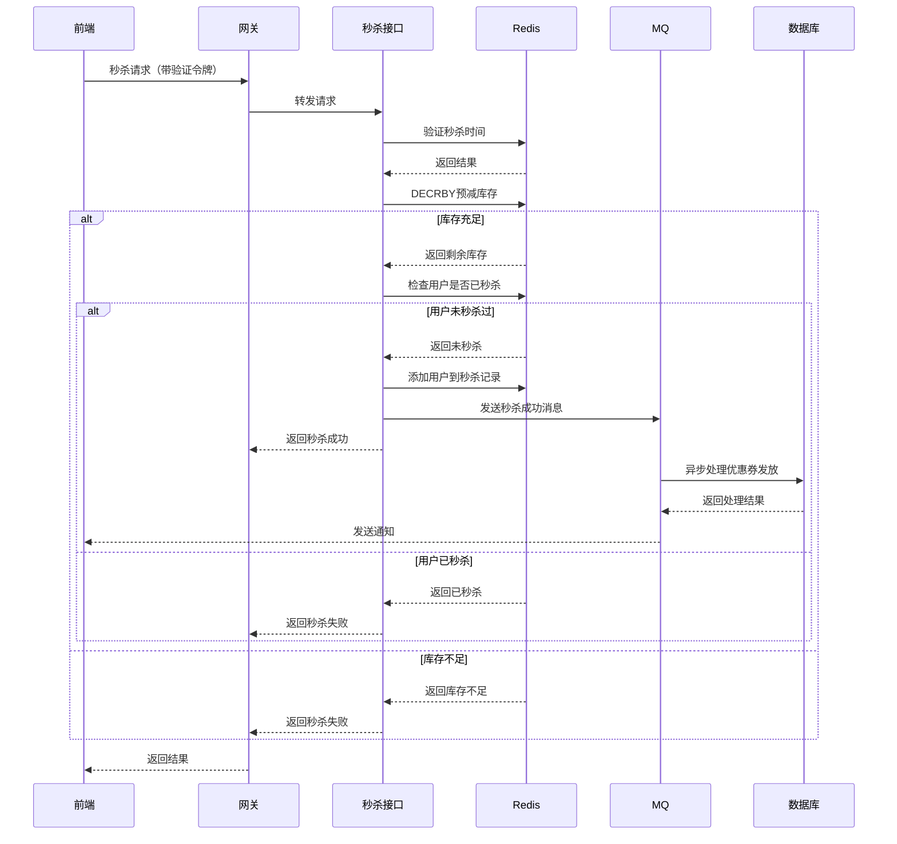

# 优惠券到点秒杀设计实现

## 1. 设计思路

基于项目现有技术栈，结合高并发秒杀场景的特点，采用了以下设计思路：

- **使用Redis减少数据库压力**：将秒杀库存、用户记录等热点数据缓存到Redis，减少数据库访问
- **MQ异步削峰处理优惠券落库**：秒杀成功后，通过消息队列异步处理优惠券发放，降低系统峰值压力
- **前端滑块验证**：防止恶意脚本批量请求，提高系统安全性
- **Redis原子操作**：使用DECRBY命令实现库存预减，确保不超卖
- **一人一单限制**：使用Redis SET集合记录用户秒杀记录，限制单用户只能秒杀一次

## 2. 系统架构

### 2.1 整体架构

```
前端层 → API网关 → 应用层 → 中间件层 → 数据层
```

### 2.2 模块职责

| 模块 | 职责 | 技术 |
|------|------|------|
| 秒杀接口模块 | 处理用户秒杀请求 | Spring Boot |
| Redis缓存模块 | 管理优惠券库存、秒杀记录 | Redis |
| 消息队列模块 | 异步处理优惠券发放 | RocketMQ |
| 数据库模块 | 持久化优惠券数据 | MySQL |

### 2.3 核心组件

- **SeckillController**：处理秒杀请求的入口
- **SeckillBizImpl**：核心业务逻辑实现
- **SeckillService**：秒杀相关服务
- **RedisService**：Redis缓存操作
- **RocketMqService**：消息队列操作
- **SeckillConsumer**：秒杀消息消费者

## 3. 数据模型

### 3.1 数据库表扩展

在`coupon_config`表中添加了以下字段：

| 字段名 | 类型 | 说明 |
|--------|------|------|
| is_seckill | char(1) | 是否为秒杀券（0:否 1:是） |
| seckill_start_time | datetime | 秒杀开始时间 |
| seckill_end_time | datetime | 秒杀结束时间 |

### 3.2 Redis数据结构

| Key | 类型 | 说明 |
|-----|------|------|
| SECKILL_COUPON_STOCK_{couponConfigId} | String | 秒杀优惠券库存 |
| SECKILL_COUPON_USER_{couponConfigId} | Set | 秒杀成功用户记录 |
| SECKILL_COUPON_INFO_{couponConfigId} | Hash | 秒杀优惠券基本信息 |
| SECKILL_COUPON_LOCK_{couponConfigId} | String | 秒杀分布式锁 |
| SECKILL_COUPON_LIMIT_{couponConfigId} | String | 秒杀请求限流 |

## 4. 核心流程

### 4.1 优惠券初始化流程

1. 管理员通过后台添加秒杀优惠券配置
2. 系统将优惠券信息同步到Redis：
   - 缓存优惠券基本信息（HASH）
   - 设置库存数量（STRING）
   - 设置过期时间（秒杀结束后24小时）

### 4.2 秒杀请求处理流程



### 4.3 异步处理流程

1. SeckillConsumer监听秒杀成功消息
2. 解析消息内容
3. 调用SeckillService.processSeckillSuccess()
4. 更新优惠券已发放数量
5. 记录用户优惠券信息
6. 发送秒杀成功通知

## 5. 关键技术实现

### 5.1 Redis库存预减

```java
// 库存预减
String stockKey = RedisConstants.SECKILL_COUPON_STOCK + couponConfigId;
Long stock = redisService.decrement(stockKey);
if (stock == null || stock < 0) {
    // 库存不足，恢复库存
    redisService.increment(stockKey, 1);
    return "优惠券已抢完";
}
```

### 5.2 用户限单检查

```java
// 检查用户是否已秒杀过该优惠券
String userKey = RedisConstants.SECKILL_COUPON_USER + couponConfigId;
Boolean isMember = redisService.sIsMember(userKey, customerId);
if (isMember != null && isMember) {
    // 用户已秒杀过，恢复库存
    redisService.increment(stockKey, 1);
    return "您已成功秒杀过该优惠券";
}
```

### 5.3 MQ异步处理

```java
// 构造消息体
JSONObject msgBody = new JSONObject();
msgBody.put("orderNo", orderNo);
msgBody.put("customerId", customerId);
msgBody.put("couponConfigId", couponConfigId);
// 发送消息到RocketMQ
rocketMqService.sendMessage(RocketMQConstants.SECKILL_COUPON_TOPIC, msgBody.toJSONString());
```

### 5.4 前端滑块验证

```javascript
// 滑块验证核心逻辑
function endDrag() {
    if (!isDragging) return;
    isDragging = false;
    
    // 判断是否验证成功
    if (currentX >= maxX * 0.95) {
        // 验证成功
        isVerified = true;
        verifyToken = 'verify_' + Date.now(); // 生成临时验证令牌
        // ...
    } else {
        // 验证失败，重置滑块
        resetSlider();
        // ...
    }
}
```

## 6. 代码结构

```
├── container-common/          # 公共模块
│   ├── container-common-core/ # 核心模块
│   │   ├── src/main/java/cn/fuguang/
│   │   │   ├── constants/     # 常量定义
│   │   │   │   ├── RedisConstants.java      # Redis常量
│   │   │   │   └── RocketMQConstants.java   # RocketMQ常量
│   │   │   └── entity/        # 实体类
│   │   │       └── CouponConfigEntity.java  # 优惠券配置实体
│   ├── container-common-redis/ # Redis模块
│   └── container-common-rocketmq/ # RocketMQ模块
├── container-order/           # 订单模块
│   ├── src/main/java/cn/fuguang/order/
│   │   ├── controller/        # 控制器
│   │   │   └── SeckillController.java  # 秒杀控制器
│   │   ├── biz/               # 业务逻辑
│   │   │   ├── SeckillBiz.java         # 秒杀业务接口
│   │   │   └── impl/
│   │   │       └── SeckillBizImpl.java # 秒杀业务实现
│   │   ├── listener/mq/       # MQ监听器
│   │   │   └── SeckillConsumer.java     # 秒杀消费者
│   │   ├── mapper/            # Mapper接口
│   │   │   └── CouponMapper.java        # 优惠券Mapper
│   │   ├── pojo/vo/           # 请求响应对象
│   │   │   ├── req/
│   │   │   │   └── SeckillCouponReq.java  # 秒杀请求
│   │   │   └── res/
│   │   │       └── SeckillCouponRes.java  # 秒杀响应
│   │   └── service/           # 服务层
│   │       ├── SeckillService.java       # 秒杀服务接口
│   │       └── impl/
│   │           └── SeckillServiceImpl.java # 秒杀服务实现
│   └── src/main/resources/
│       ├── mapper/
│       │   └── CouponMapper.xml          # 优惠券Mapper配置
│       └── static/
│           └── seckill.html              # 秒杀前端页面
```

## 7. 安全性设计

### 7.1 前端安全

- **滑块验证**：防止恶意脚本批量请求
- **请求频率限制**：限制单个用户的请求频率
- **临时令牌**：每次验证生成唯一临时令牌，防止重放攻击

### 7.2 后端安全

- **参数校验**：严格校验请求参数，防止非法请求
- **秒杀时间验证**：确保只有在秒杀时间内才能进行秒杀
- **库存预减原子操作**：使用Redis DECRBY确保库存不超卖
- **用户限单**：使用Redis SET集合确保一人一单
- **异常处理**：异常情况下恢复库存，确保数据一致性

### 7.3 数据安全

- **敏感数据加密**：敏感数据加密存储
- **数据库访问权限控制**：最小权限原则
- **日志记录**：详细记录秒杀操作，便于审计和排查问题

## 8. 性能优化

### 8.1 缓存优化

- **热点数据缓存**：将秒杀库存、用户记录等热点数据缓存到Redis
- **缓存预热**：秒杀开始前将优惠券信息加载到Redis
- **合理设置过期时间**：秒杀结束后24小时过期，自动清理缓存

### 8.2 异步处理

- **MQ异步削峰**：秒杀成功后通过MQ异步处理，降低系统峰值压力
- **非阻塞响应**：立即返回秒杀结果，后续通过消息通知最终状态

### 8.3 数据库优化

- **减少数据库访问**：热点数据通过Redis访问，减少数据库压力
- **批量操作**：异步处理时可考虑批量更新，提高处理效率
- **索引优化**：为高频查询字段建立索引

## 9. 部署建议

### 9.1 集群部署

- **Redis集群**：部署Redis集群，提高缓存可用性和性能
- **RocketMQ集群**：部署RocketMQ集群，提高消息处理能力
- **应用集群**：部署多个应用实例，提高系统吞吐量

### 9.2 监控告警

- **秒杀请求量监控**：实时监控秒杀请求量，及时发现异常
- **Redis监控**：监控Redis内存使用、命中率等指标
- **MQ监控**：监控消息队列堆积情况，及时处理
- **告警机制**：设置合理的告警阈值，及时发现问题

## 10. 测试建议

### 10.1 功能测试

- **秒杀时间验证**：验证秒杀开始前后的行为
- **库存扣减**：验证库存正确扣减，不超卖
- **用户限单**：验证单用户只能秒杀一次
- **异步处理**：验证异步处理是否正确

### 10.2 性能测试

- **并发测试**：模拟高并发场景，测试系统性能
- **压测**：逐步增加并发量，测试系统极限
- **稳定性测试**：长时间运行，测试系统稳定性

### 10.3 安全性测试

- **恶意请求测试**：模拟恶意脚本请求，测试系统防护能力
- **压力测试**：测试系统在高压力下的安全性

## 11. 总结

本设计实现了一个高性能、高可用、安全可靠的优惠券到点秒杀系统，采用了Redis缓存、MQ异步处理、前端滑块验证等技术，能够有效应对高并发秒杀场景。系统具备良好的扩展性和可维护性，能够满足不同规模的秒杀需求。